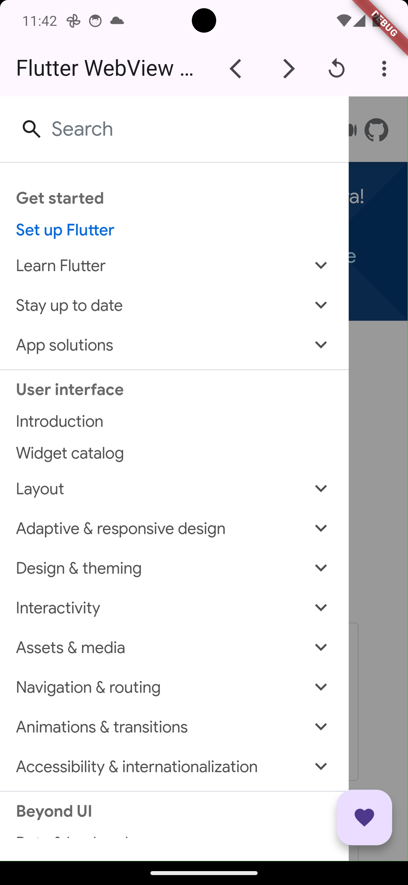
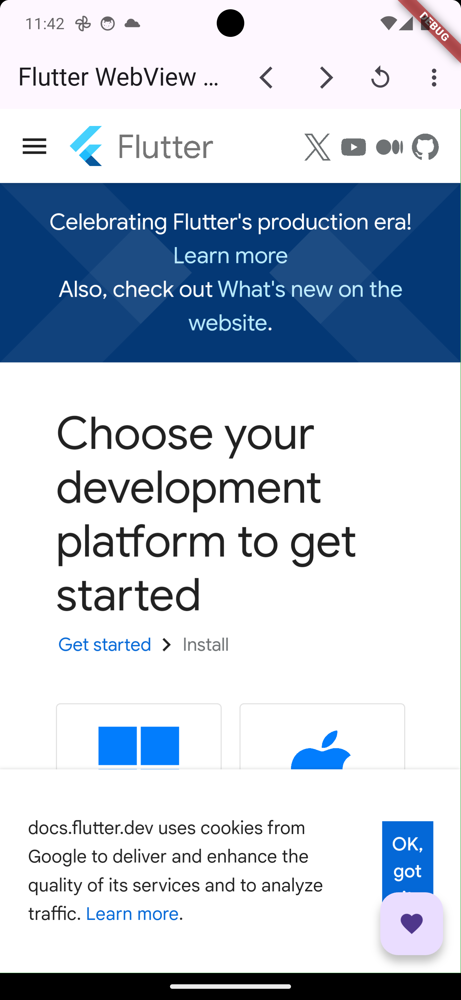

# Example of Web View with Flutter dart
  
 


## Features
* **Creating web view for android and iOS application:**  
 

## File stracture

    
    ├── lib
        ├── main.dart                  

 
  - main.dart: Contains all the files for now.
 
 
<p float="left">
 </p>

 

## Run Locally

Clone the project

```bash
  git clone git@github.com:abdulawalarif/web_view_with_flutter.git
```

Go to the project directory

```bash
  cd web_view_with_flutter
```

Install dependencies

```bash
  flutter pub get
```

Connect a physical device or start a virtual device on your machine

```bash
  flutter run
```

## Customization Tips
- Add url: Add new URL for testing and changing the look of this project.
- Asset Customization: Add some assets file and add configure the file based on your need.
 
## Reporting Bugs or Requesting Features?

If you found an issue or would like to submit an improvement to this project,
please submit an issue using the issues tab above. If you would like to submit a PR with a fix, reference the issue you created!

 
## Author

- [@abdulawalarif](https://github.com/abdulawalarif) 
  
 
 